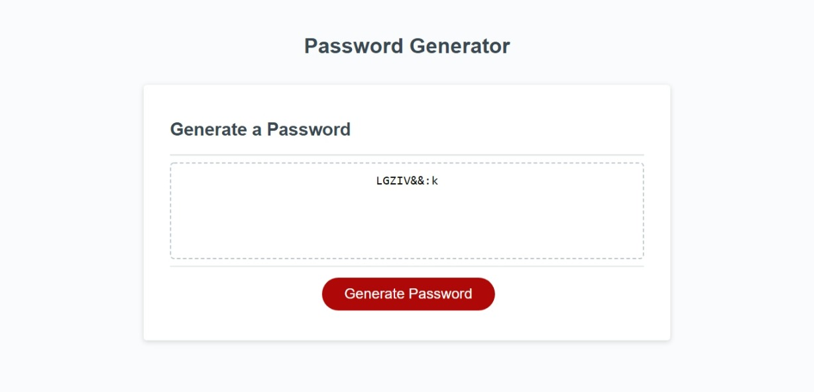

# Password-Generator

# Description

This application was created to generate a random password for employees based on criteria that they have selected.The password includes special characters, numbers, lowercase, and uppercase letters. It will assist employees in having a secure and strong password that no one else can guess, which enables extra safety.

# Usage

The user will select the red button titled "Generate Password". Once the user selects this button a prompt will appear asking the user how many characters do they want the password to have. Once the user answers this question, a message will repeat back how many characters the password will have. The user will then be presented with questions to confirm if they would like uppercase, lowercase, numbers, and special characters. A password will then appear with a mixture of these characters within the text area. The password cannot contain less than 8 characters and more than 128 characters. 

# License

Copyright © 2022 <Anquavious Grant>

Permission is hereby granted, free of charge, to any person obtaining a copy of this software and associated documentation files (the “Software”), to deal in the Software without restriction, including without limitation the rights to use, copy, modify, merge, publish, distribute, sublicense, and/or sell copies of the Software, and to permit persons to whom the Software is furnished to do so, subject to the following conditions:

The above copyright notice and this permission notice shall be included in all copies or substantial portions of the Software.

THE SOFTWARE IS PROVIDED “AS IS”, WITHOUT WARRANTY OF ANY KIND, EXPRESS OR IMPLIED, INCLUDING BUT NOT LIMITED TO THE WARRANTIES OF MERCHANTABILITY, FITNESS FOR A PARTICULAR PURPOSE AND NONINFRINGEMENT. IN NO EVENT SHALL THE AUTHORS OR COPYRIGHT HOLDERS BE LIABLE FOR ANY CLAIM, DAMAGES OR OTHER LIABILITY, WHETHER IN AN ACTION OF CONTRACT, TORT OR OTHERWISE, ARISING FROM, OUT OF OR IN CONNECTION WITH THE SOFTWARE OR THE USE OR OTHER DEALINGS IN THE SOFTWARE.